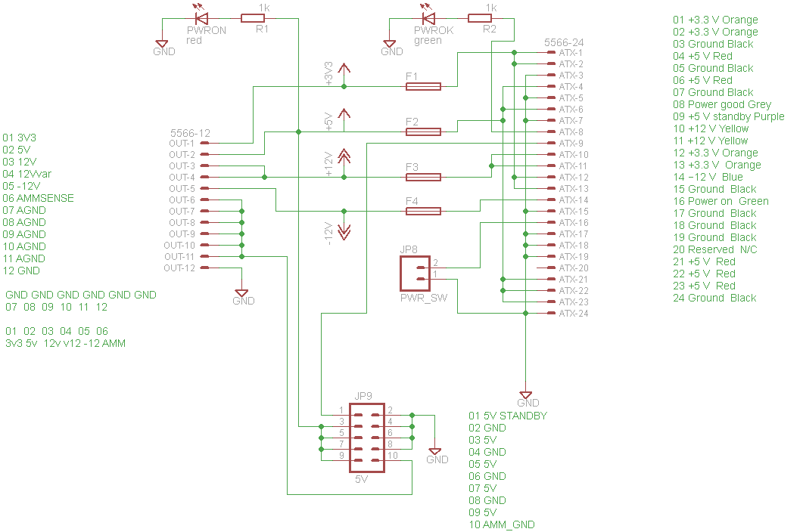
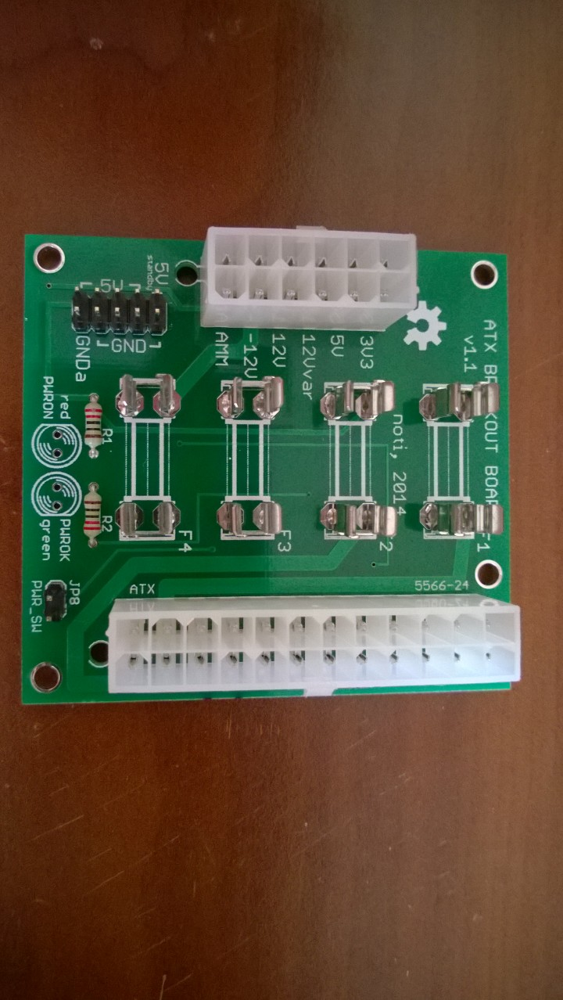

# ATX breakout board

Breakout board for the 24pin [ATX](https://en.wikipedia.org/wiki/ATX) connector.

I use it to turn an old ATX [PSU](https://en.wikipedia.org/wiki/Power_supply_unit_(computer)) into a bench power supply.

## Features
* 3.3v, 5v, 12v, -12v
* All of the outputs are fused
* Connector for the PSU on button
* Connector for power on and power ok leds
* Connector for an ammeter
* Extra 5v connectors for misc stuff
* Connector for standby 5v
* Rated for 10amps per rail
 
 
## Similar, commercially available products
* Seeed Studio: [http://www.seeedstudio.com/depot/ATX-breakout-board-bench-power-supply-p-1222.html](http://www.seeedstudio.com/depot/ATX-breakout-board-bench-power-supply-p-1222.html)
* Sparkfun: [https://www.sparkfun.com/products/retired/9558](https://www.sparkfun.com/products/retired/9558)

## Pictures

